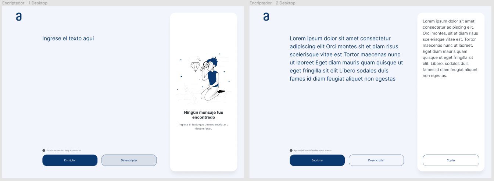
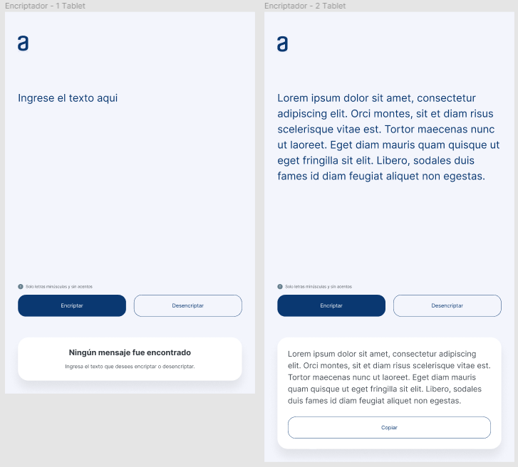
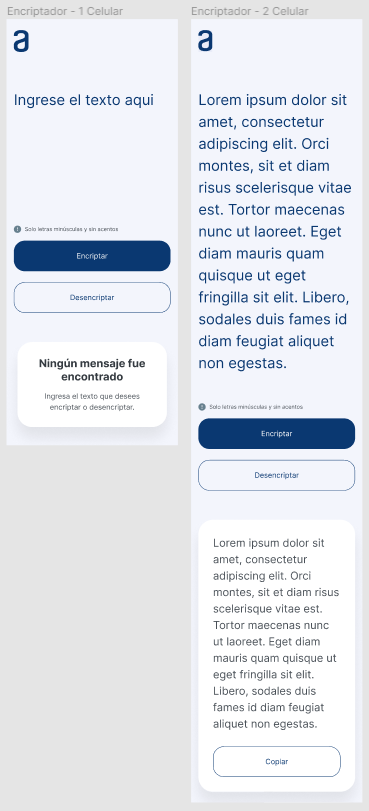

# Alura LATAM Challenge

## **_Desafio 1_**: Construye el encriptador con HTML y CSS

### Deploy Github Pages: https://pacocela.github.io/encriptador-alura-challenge/

---

## **Description**

## HTML Y CSS

Plantilla propuesta para la implementación de este desafío, recuerda que puedes usar CSS para modificar colores y fuentes, adicionar bordes y hasta hacer animaciones! Por ejemplo:

- Cambiar la fuente, el tamaño y el color del título
- Adicionar un color, degradado o imagen como fondo de tu sitio web
- Cambiar estilos, colores y bordes de los botones, explotar tu creatividad o puedes replicar exactamente el mismo diseño presentado, todo quedará a tu criterio.

## JAVASCRIPT

Las "llaves" de encriptación que utilizaremos son las siguientes:

- La letra "e" es convertida para "enter"
- La letra "i" es convertida para "imes"
- La letra "a" es convertida para "ai"
- La letra "o" es convertida para "ober"
- La letra "u" es convertida para "ufat"

Requisitos:

1. Debe funcionar solo con letras minúsculas
2. No deben ser utilizados letras con acentos ni caracteres especiales
3. Debe ser posible convertir una palabra para la versión encriptada también devolver una palabra encriptada para su versión original. 

Por ejemplo:
"gato" => "gaitober"
gaitober" => "gato" 

- La página debe tener campos para inserción del texto que será encriptado o desencriptado, y el usuario debe poder escoger entre as dos opciones.
- El resultado debe ser mostrado en la pantalla.

---

#### Elementos principales de la página

- Título de su sitio web
- Campo para el texto que va a ser encriptado/desencriptado
- Un botón para encriptar
- Un botón para desencriptar
- Área para mostrar el texto encriptado/desencriptado.   
  **_Extra!_**
- Crear el botón de copiar en el área de presentación de mensajes.
- página web Responsive, para que tu página se adapte a diferentes dispositivos es necesario ir más allá en el CSS.
- Un rodapie con los datos de la persona que desarrolló el sitio web!
   

---

## Observaciones
1. En caso se pegue texto el cual contiene algun caracter especial, mayuscula o tilde no se podra realizar el pegado dentro del textarea

---

#### Diseño

- **desktop**
  
- **Tablet** 
  
- **Mobile** 
  
